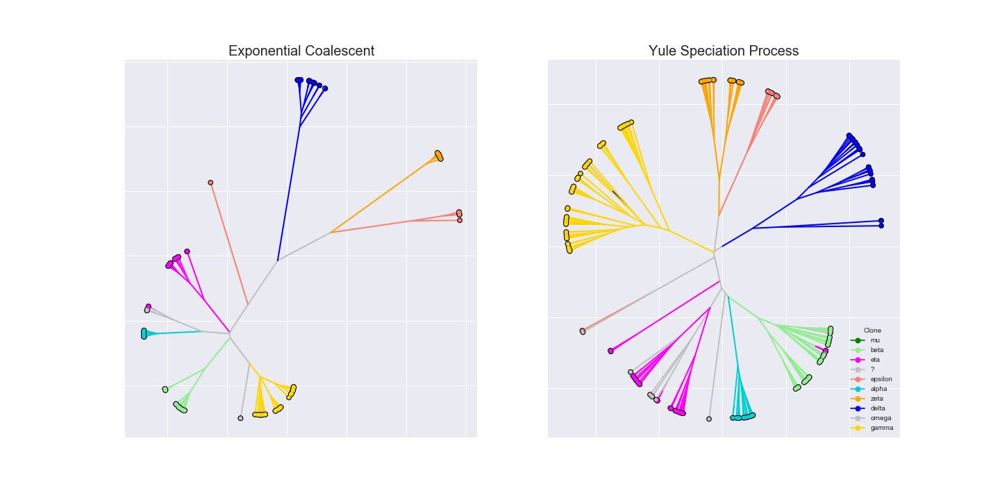
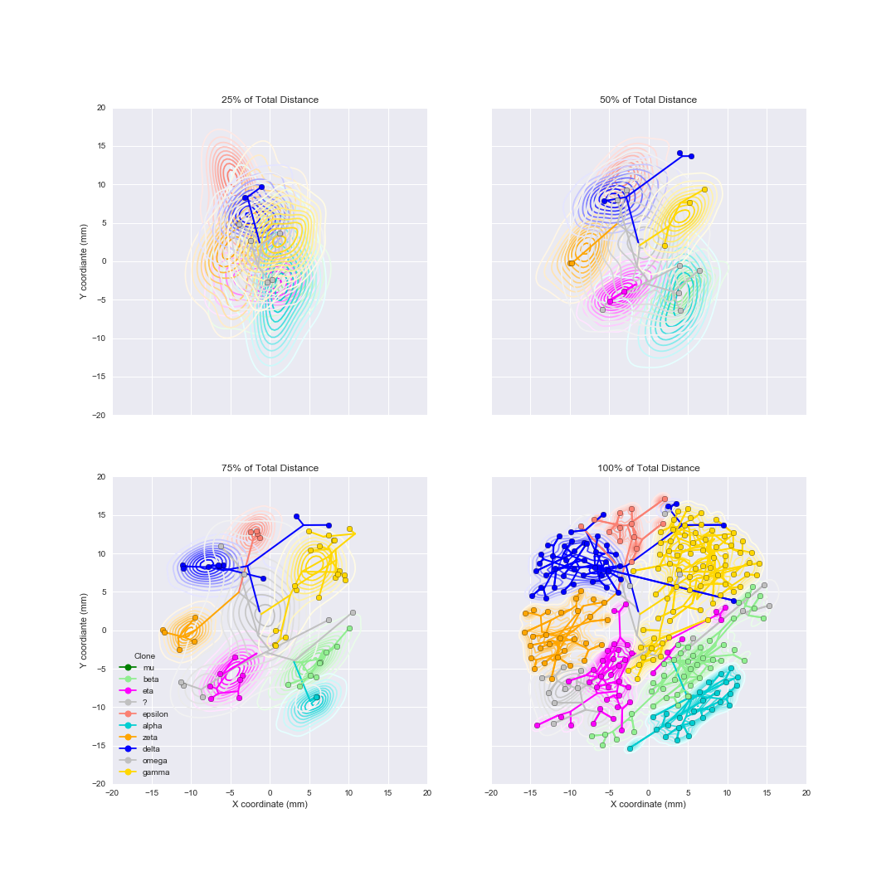
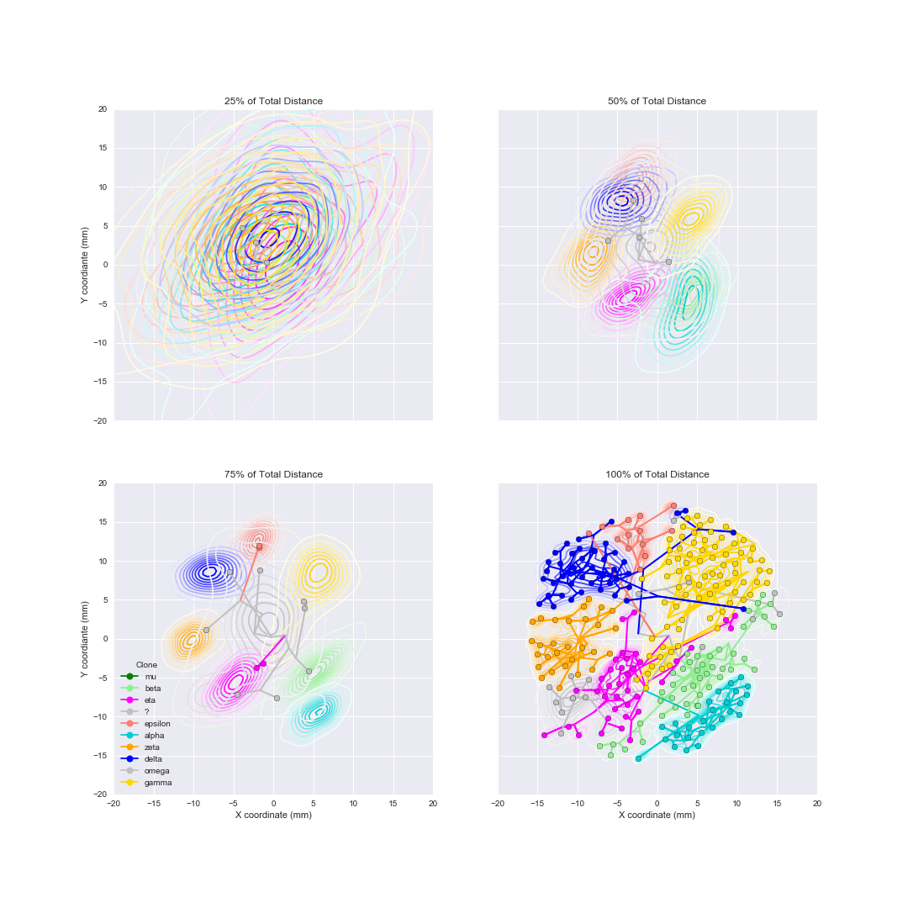
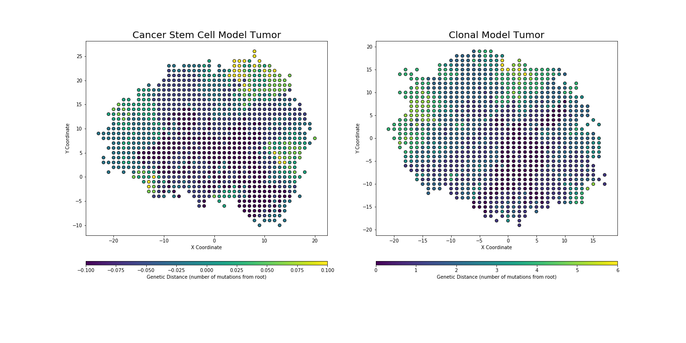
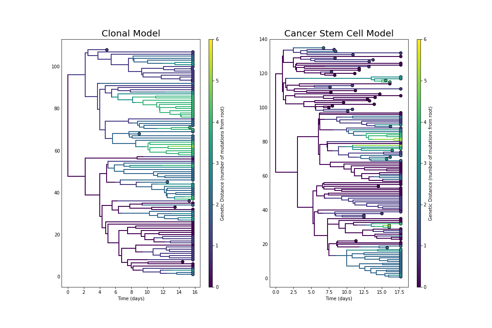
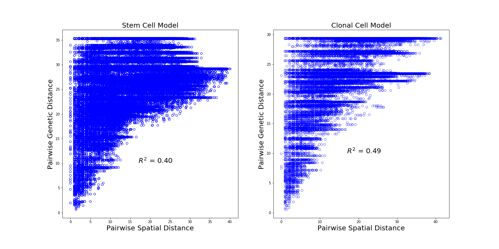
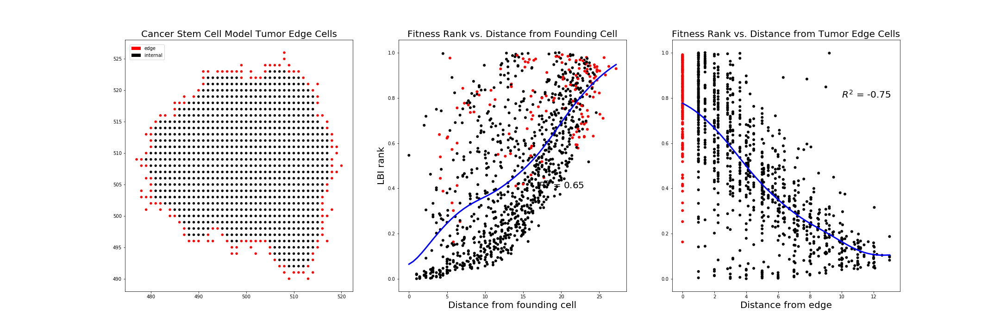

# Phylogenetic analysis of spatial and clonal dynamics in hepatocellular carcinoma

#### Maya Lewinsohn1,2, Trevor Bedford1

1Vaccine and Infectious Disease Division, Fred Hutchinson Cancer Research Center, Seattle, WA, USA, 2MSTP Program, University of Washington, Seattle, WA, USA

## Introduction

This project analyzes data published by Ling et al., ["Extremely high genetic diversity in a single tumor points to prevalence of non-Darwinian cell evolution" (2015)](http://www.pnas.org/content/112/47/E6496.full). In this paper, the authors extracted DNA from 286 tumor samples collected from a single hepatocellular carcinoma (hcc) cross section to examine intra-tumor diversity.
## File descriptions

### Data

* [alleles.csv](data/alleles.csv) -- raw data
* [locations.csv](data/locations.csv) -- pixel locations of each sample measured from Figure 2A using Preview
* [clones.csv](data/clones.csv) -- clone labels of each sample *TB: I don't see this file*
* [alleles_fasta_meta.txt](data/alleles_fasta_meta.txt) -- output of CancerProjectIData.ipynb for BEAST analysis
* [CancerProjectIData.ipynb](data/CancerProjectIData.ipynb) -- contains script to clean and parse raw data

### Analysis

* [CancerProjectI-BALTIC.ipynb](CancerProjectI-BALTIC.ipynb) -- analysis of trees draw from posterior distribution in BEAST output
* [expcol_spatial_dash_MLE.mcc](expcol_spatial_dash_MLE.mcc) -- MCC tree computed from posterior distribution with exponential coalescent tree prior
* [yule_spatial_dash_MLE.mcc](expcol_spatial_dash_MLE.mcc) -- MCC tree computed from posterior distribution with yule speciation tree prior
### Large file storage
* [Dropbox link to BEAST output](https://www.dropbox.com/s/1y90xn91d2d1s0v/maya.zip?dl=0) -- .log and .tree files from BEAST run

### Models

* [stem_cell_model.ipynb](stem_cell_model.ipynb) -- simulation of spatially confined tumor growth and genetic distance analysis 

## Methods and Results

### Data
Data table S3 of the [supplemental dataset](http://www.pnas.org/content/112/47/E6496.abstract?tab=ds) published in Ling et al., (2015)  contains genotyping data on 286 individual punches collected from a 3.5 centimeter cross-section of the tumor (~20,000 cells/punch) and from 1 normal sample. Whole exome sequencing was completed on 22 of these sections and used to identify 35 polymorphic nonsynonymous sites that screens with Sequenom genotyping. The supplemental data table records the average mutant allele frequency of each SNV for each site on the tumor. "-" and "F" indicate that the validation was not attempted or failed respectively. "P" indicates that validation was not attempted but the mutation is inferred to be present based on clonal boundaries. 

The data was first converted to [FASTA format](data/alleles_fasta_meta.txt). Each sequence is represented by a series of ones and zeros, representing the presence or absence of each mutation, respectively. In addition, the FASTA file contains the location in x and y pixel coordinates, and published clone designated by characteristic mutations as determined by Ling et al. Locations were extracted based on the published diagram. 

### Inferring spatial and genetic evolution 

A posterior of trees was generated through BEAST with Yule speciation or exponential coalescent tree priors and a strict molecular clock. Location was input as a continuous bivariate trait that represented latitude and longitude and was modeled with gamma relaxed random walk (RRW). A maximum clade credibility (MCC) tree was derived from the BEAST tree prior using Tree Annotator. 

The MCC tree was interpreted through the BALTIC module in which tree, node, and leaf objects were created that stored information necessary to construct the phylogeny. Given inferred ancestral states of each node, clone traits were mapped onto each node based on clonal mutations defined to [Supplemental Table S3](http://www.pnas.org/content/112/47/E6496.abstract?tab=ds) published in Ling et al,. Retroactively mapping the state values was generally successful, except in rare cases in which the sample sequence contained mutations that were characteristic of more than one mutation. In these cases, the published clone assignments were likely informed by location. In addition, the general structure MCC trees, agreed with the published clonal distinctions however, there are discrepancies that are likely due to minimal genotype information in a minority of samples.

### Inferring spatial evolution through time
Based on inferred spatial coordinates generated by the gamma RRW model in BEAST, spatial evolution of the MCC tree and across the tree posterior could be visualized. In the time-slicing algorithm, only nodes before a specified time, in this case at 25%, 50%, 75% or 100% of the total phylogenic distance, were retained. For branches that crossed this line, linear interpolation between the node before and after the time line determined the spatial coordinates of a new leaf at this intersection. A Gaussian kernel density estimate was used to create a contour plot representing the inferred locations across the posterior. These results demonstrates that the clones on the whole appear to have spatial boundaries. It should be noted that subclones identified by Ling et al., are not distinguished. 

#### Spatial Evolution -- Yule Speciation Prior
 
#### Spatial Evolution -- Exponential Coalescent Prior

### Close genetic distances predicts small genetic distance

From the spatial analysis of clonal populations through time, it is clear that clonal growth seems to exhibit local dispersion. To examine this relationship, the pairwise spatial and genetic distance was calculated for each sample. 
 

### Cancer simulation model

To model the expected relationship between genomic and spatial divergence if spatial location largely determines cell growth potential,  we used a cell automata model based on the one described in "Evolution and Phenotypic Selection of Cancer Stem Cells" (Poleszczuk, Hahnfeldt, Enderling, PLOS Computational Biology, 2015). 

Each simulation begins with a stem cell object that has a certain proliferation and mutation rate. Stem cells can divide to give rise to either another stem cell (symmetric division) or a clonal cell (asymmetric division) which has an associated mortality rate and limited proliferation capacity. For comparison, a pure clonal model was also implemented. In this model, the origin cell object has a discrete mortality rate and only divides symmetrically to form additional clonal cells. While in the stem cell model clonal cells had limited proliferation potential, in order to maintain a viable tumor in a pure clonal model, cells do not have a discrete proliferation potential.In both models, cells exist in a lattice and replication is confined by the presence of surrounding cells since cells may only divide is there is an adjacent empty lattice slot. The simulation continued until a maximum number of tumor cells (1000) is reached.

In the clonal simulation, cells have a proliferation rate of 1 division per 24 hours and a mortality rate of 0.5 deaths per 24 hours. In the cancer stem cell simulation, both stem cell and clonal cells have an equal division rate of 1 division per 24 hours. Stem cells divide asymmetrically with probability 0.1 and clonal cells have a proliferation capacity of 10. These rates are based on those published in the original model, however, the specific tree structure likely depend greatly on these parameters. 

#### Simulated spatial divergence
Generally, the number of mutations present in a cell increase as the tumor expands outwards where there is less resistance to grow, as would be expected based on the enforced spatial constraits and this is confirmed in the pairwise genetic and spacial distance analysis. 
 

#### LBI ranking= -- Simulated versus observed spatial fitness

[Neher et al.,(2014)](https://www.ncbi.nlm.nih.gov/pmc/articles/PMC4227306/) developed the Local Branching Index (LBI) as a heuristic to infer fitness based on the shape of the genealogical tree. The algorithm using a messaging system to take into account local branches with exponentially decreasing memory, determined by the $tau$  parameter. 

In the simulated models, the LBI rank was highly correlated with spatial distance from the founding cell due to the model's strict growth contraints in the center of the tumor.

_

In contrast, there was no correlation between LBI rank and distance from the center of the tumor in the observed tumor data based on the inferred phylogenies. 

This result could be do to limited phylogeny information, or could indicate that fitness is largely determined by factors other than spatial. 

## Discussion
Overall, the BEAST software was used to infer the spatial evolution of tumor HCC-15. Generally, genetic and spatial anlysis indicated that tumor cells expand locally, however additional analysis is needed to further define this dynamic. In addition, an effect of spatial location on fitness was not observed, perhaps due to limited sequence data or that other cell-intrinsic or enviromental factors are more important in determining fitness.  

